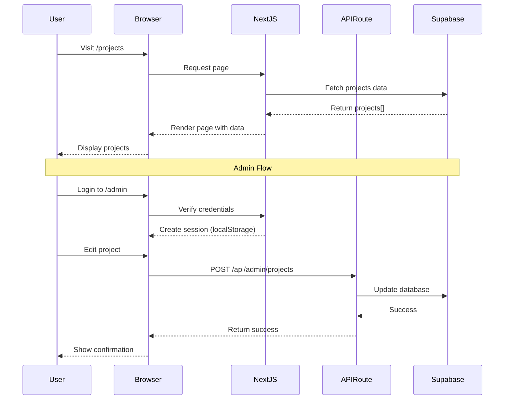
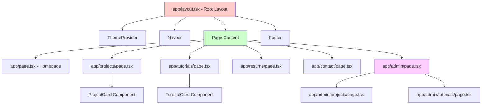
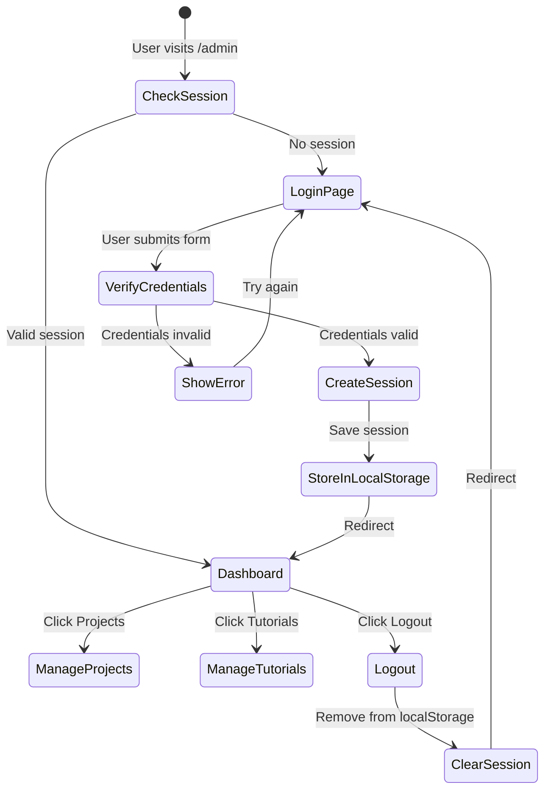
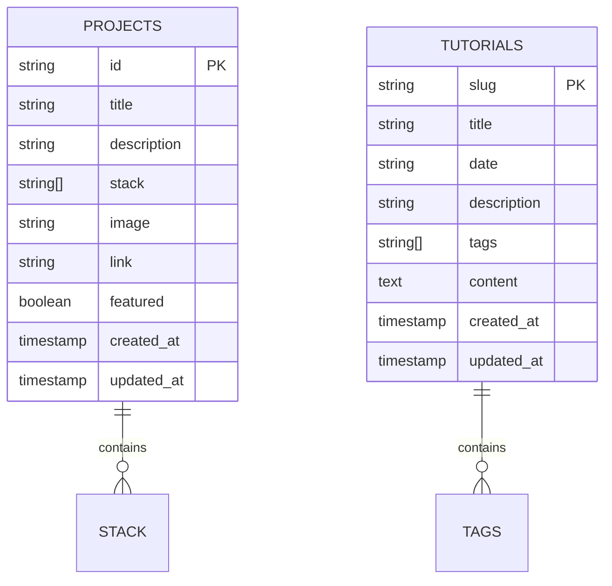
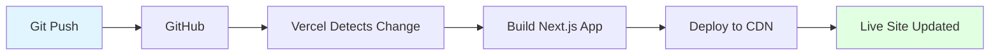

# 🏗️ Portfolio Architecture Documentation

Complete guide to understanding the codebase structure, data flow, and how everything works together.

---

## 📊 System Architecture Diagram

```mermaid
graph TB
    subgraph "User Browser"
        A[User] --> B[Next.js Frontend]
        B --> C[React Components]
        C --> D[Pages]
        C --> E[Shared Components]
    end

    subgraph "Next.js Server"
        F[API Routes] --> G[/api/admin/projects]
        F --> H[/api/admin/tutorials]
    end

    subgraph "External Services"
        I[Supabase PostgreSQL]
        J[Vercel CDN]
    end

    B --> F
    G --> I
    H --> I
    B --> J
    
    style A fill:#e1f5ff
    style I fill:#ffe1e1
    style J fill:#e1ffe1
```

---

## 🔄 Frontend-Backend Data Flow



---

## 🧩 Component Hierarchy



---

## 🔐 Admin Authentication Flow



---

## 🛣️ API Routes Structure

```mermaid
graph LR
    A[Client Request] --> B{Route Type}
    
    B -->|GET| C[/api/admin/projects]
    B -->|POST| D[/api/admin/projects]
    B -->|GET| E[/api/admin/tutorials]
    B -->|POST| F[/api/admin/tutorials]
    B -->|DELETE| G[/api/admin/tutorials]
    
    C --> H[Supabase: SELECT]
    D --> I[Supabase: INSERT]
    E --> J[Supabase: SELECT]
    F --> K[Supabase: UPSERT]
    G --> L[Supabase: DELETE]
    
    H --> M[Return JSON]
    I --> M
    J --> M
    K --> M
    L --> M
    
    style A fill:#e1f5ff
    style M fill:#ffe1e1
```

---

## 💾 Database Schema



---

## 📝 How It Works

### 1. User Visits Public Page (e.g., /projects)

**Flow:**
1. Browser requests `/projects`
2. Next.js server executes page component
3. Component queries Supabase directly
4. Server renders HTML with data
5. Browser receives complete page (fast!)

**Code:** `app/projects/page.tsx`
```typescript
'use client'
const [projects, setProjects] = useState([])

useEffect(() => {
  async function loadProjects() {
    const { data } = await supabase.from('projects').select('*')
    setProjects(data)
  }
  loadProjects()
}, [])
```

### 2. Admin Edits Content

**Flow:**
1. Admin logs in at `/admin`
2. Credentials verified against env variables
3. Session stored in localStorage
4. Admin navigates to `/admin/projects`
5. Page fetches data from API route
6. Admin makes changes in UI
7. Clicks "Save All"
8. Browser sends POST to `/api/admin/projects`
9. API route updates Supabase
10. Changes visible immediately on public pages

**Code:** `app/admin/projects/page.tsx`
```typescript
const handleSave = async () => {
  const response = await fetch('/api/admin/projects', {
    method: 'POST',
    headers: { 'Content-Type': 'application/json' },
    body: JSON.stringify(projects)
  })
  if (response.ok) alert('Saved!')
}
```

### 3. API Route Processes Request

**Flow:**
1. Vercel receives HTTP request
2. Routes to serverless function
3. Function connects to Supabase
4. Executes database query
5. Returns JSON response

**Code:** `app/api/admin/projects/route.ts`
```typescript
export async function POST(request: Request) {
  const projects = await request.json()
  await supabase.from('projects').delete().neq('id', '')
  await supabase.from('projects').insert(projects)
  return NextResponse.json({ success: true })
}
```

---

## 📁 File Structure

```
abhay-portfolio/
├── app/
│   ├── layout.tsx              # Root layout
│   ├── page.tsx                # Homepage
│   ├── projects/page.tsx       # Projects list
│   ├── tutorials/
│   │   ├── page.tsx            # Tutorials list
│   │   └── [slug]/page.tsx     # Tutorial detail
│   ├── admin/
│   │   ├── page.tsx            # Admin dashboard
│   │   ├── projects/page.tsx   # Project editor
│   │   └── tutorials/page.tsx  # Tutorial editor
│   └── api/admin/
│       ├── projects/route.ts   # Projects API
│       └── tutorials/route.ts  # Tutorials API
│
├── components/
│   ├── Navbar.tsx              # Navigation
│   ├── ProjectCard.tsx         # Project display
│   └── TutorialCard.tsx        # Tutorial display
│
├── lib/
│   ├── supabase.ts             # Database client
│   └── adminAuth.ts            # Authentication
│
└── .env.local                  # Environment variables
```

---

## 🔑 Key Concepts

### Server-Side Rendering (SSR)
- Pages render on server with data
- Fast initial load
- SEO friendly
- Used for: public pages

### Client-Side Rendering (CSR)
- Pages render in browser
- Interactive features
- Loading states
- Used for: admin pages

### API Routes
- Serverless functions
- Run on Vercel servers
- Connect to Supabase
- Return JSON data

### Supabase
- PostgreSQL database
- Hosted in cloud
- Real-time updates
- Single source of truth

---

## 🚀 Deployment Flow



---

## 📚 Summary

**Frontend:** React + Next.js + TypeScript
**Backend:** Next.js API Routes (serverless)
**Database:** Supabase PostgreSQL
**Styling:** Tailwind CSS
**Deployment:** Vercel

**Data Flow:**
1. Public pages fetch from Supabase (fast)
2. Admin pages use API routes (secure)
3. All changes saved to database (instant)
4. No Git commits needed for content

**Authentication:**
- Simple localStorage-based
- Environment variable credentials
- 24-hour session expiry
- Suitable for personal use

---

For more details, see:
- `ADMIN_GUIDE.md` - How to use admin panel
- `CHANGELOG.md` - All code changes
- `README.md` - Setup instructions
