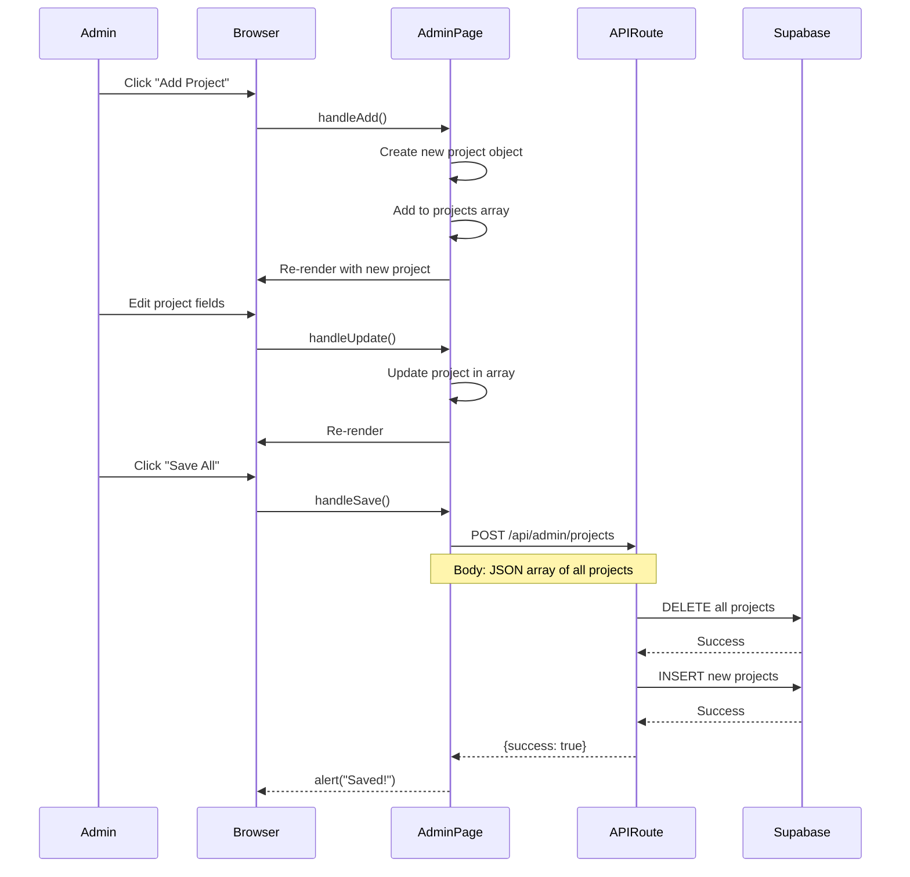

# 💻 Code Explanation - Line by Line

Complete walkthrough of how every part of the codebase works.

---

## 📦 Core Files

### 1. Supabase Client (`lib/supabase.ts`)

```typescript
import { createClient } from '@supabase/supabase-js'
```
**What:** Import Supabase library
**Why:** Needed to connect to database

```typescript
const supabaseUrl = process.env.NEXT_PUBLIC_SUPABASE_URL || ''
const supabaseAnonKey = process.env.NEXT_PUBLIC_SUPABASE_ANON_KEY || ''
```
**What:** Get credentials from environment variables
**Why:** Keep secrets secure, not in code
**Note:** `NEXT_PUBLIC_` prefix makes it available in browser

```typescript
export const supabase = createClient(supabaseUrl, supabaseAnonKey)
```
**What:** Create Supabase client instance
**Why:** Single connection used throughout app
**Usage:** `import { supabase } from '@/lib/supabase'`

```typescript
export interface Project {
  id: string
  title: string
  description: string
  stack: string[]
  image: string
  link: string
  featured: boolean
}
```
**What:** TypeScript interface for type safety
**Why:** Prevents bugs, enables autocomplete
**Usage:** `const project: Project = {...}`

---

### 2. Admin Authentication (`lib/adminAuth.ts`)

```typescript
const ADMIN_CREDENTIALS = {
  username: process.env.NEXT_PUBLIC_ADMIN_USERNAME || 'admin',
  password: process.env.NEXT_PUBLIC_ADMIN_PASSWORD || 'admin123',
}
```
**What:** Load admin credentials from env vars
**Why:** Secure, changeable without code changes
**Security:** Change default password in production!

```typescript
export function verifyCredentials(username: string, password: string): boolean {
  return username === ADMIN_CREDENTIALS.username && 
         password === ADMIN_CREDENTIALS.password
}
```
**What:** Check if login credentials match
**Why:** Gate access to admin panel
**Returns:** `true` if match, `false` if not

```typescript
export function createSession(username: string): AdminSession {
  const session: AdminSession = {
    isAuthenticated: true,
    username,
    loginTime: Date.now()
  }
  
  localStorage.setItem('admin_session', JSON.stringify(session))
  return session
}
```
**What:** Create and store login session
**Why:** Remember user is logged in
**Storage:** Browser's localStorage (persists across page reloads)
**Format:** JSON string

```typescript
export function getSession(): AdminSession | null {
  const sessionData = localStorage.getItem('admin_session')
  if (!sessionData) return null
  
  const session = JSON.parse(sessionData)
  
  const sessionAge = Date.now() - session.loginTime
  const maxAge = 24 * 60 * 60 * 1000 // 24 hours
  
  if (sessionAge > maxAge) {
    clearSession()
    return null
  }
  
  return session
}
```
**What:** Retrieve and validate session
**Why:** Check if user is still logged in
**Expiry:** 24 hours after login
**Returns:** Session object or null

```typescript
export function clearSession(): void {
  localStorage.removeItem('admin_session')
}
```
**What:** Delete session (logout)
**Why:** Security - clear credentials
**Usage:** Called on logout button click

---

### 3. API Route - Projects (`app/api/admin/projects/route.ts`)

```typescript
import { NextResponse } from 'next/server'
import { supabase } from '@/lib/supabase'
```
**What:** Import Next.js response helper and Supabase client
**Why:** Need to return HTTP responses and query database

```typescript
export async function GET() {
```
**What:** Define GET endpoint handler
**Why:** Handle GET requests to `/api/admin/projects`
**Async:** Can use `await` for database queries

```typescript
  const { data, error } = await supabase
    .from('projects')
    .select('*')
    .order('created_at', { ascending: false })
```
**What:** Query Supabase database
**Breakdown:**
- `.from('projects')` - Select table
- `.select('*')` - Get all columns
- `.order(...)` - Sort by creation date, newest first
**Returns:** `{ data: [...], error: null }` or `{ data: null, error: {...} }`

```typescript
  if (error) throw error
```
**What:** Check for database errors
**Why:** Catch and handle errors properly

```typescript
  return NextResponse.json(data || [])
```
**What:** Return JSON response
**Why:** Send data back to client
**Format:** `[{project1}, {project2}, ...]`
**Fallback:** Empty array if no data

```typescript
export async function POST(request: Request) {
  const projects = await request.json()
```
**What:** Parse JSON from request body
**Why:** Get projects data sent from admin page
**Format:** Array of project objects

```typescript
  await supabase.from('projects').delete().neq('id', '')
```
**What:** Delete all existing projects
**Why:** Replace all projects with new data
**Logic:** `.neq('id', '')` means "where id is not empty" (matches all)

```typescript
  const { error } = await supabase.from('projects').insert(projects)
```
**What:** Insert new projects into database
**Why:** Save updated data
**Batch:** Inserts all projects at once

```typescript
  return NextResponse.json({ success: true, message: 'Projects saved successfully' })
```
**What:** Return success response
**Why:** Tell client operation completed
**Format:** `{ success: true, message: "..." }`

---

### 4. Admin Dashboard (`app/admin/page.tsx`)

```typescript
'use client'
```
**What:** Mark as client component
**Why:** Uses browser APIs (localStorage, useState)
**Effect:** Runs in browser, not server

```typescript
const [isAuthenticated, setIsAuthenticated] = useState(false)
const [username, setUsername] = useState('')
const [password, setPassword] = useState('')
```
**What:** React state variables
**Why:** Track login status and form inputs
**Updates:** Trigger re-renders when changed

```typescript
useEffect(() => {
  const session = getSession()
  if (session?.isAuthenticated) {
    setIsAuthenticated(true)
  }
  setLoading(false)
}, [])
```
**What:** Check if already logged in on page load
**Why:** Don't make user login again if session exists
**Runs:** Once when component mounts (empty dependency array `[]`)

```typescript
const handleLogin = (e: React.FormEvent) => {
  e.preventDefault()
```
**What:** Handle form submission
**Why:** Process login attempt
**`e.preventDefault()`:** Stop form from refreshing page

```typescript
  if (verifyCredentials(username, password)) {
    createSession(username)
    setIsAuthenticated(true)
  } else {
    setError('Invalid credentials. Please try again.')
  }
}
```
**What:** Verify credentials and create session
**Why:** Authenticate user
**Success:** Show dashboard
**Failure:** Show error message

```typescript
if (!isAuthenticated) {
  return (
    <form onSubmit={handleLogin}>
      <input 
        value={username}
        onChange={(e) => setUsername(e.target.value)}
      />
    </form>
  )
}
```
**What:** Show login form if not authenticated
**Why:** Gate access to admin features
**Controlled input:** Value synced with state

```typescript
return (
  <div>
    <button onClick={() => router.push('/admin/projects')}>
      Manage Projects
    </button>
  </div>
)
```
**What:** Show dashboard if authenticated
**Why:** Provide access to admin features
**Navigation:** `router.push()` changes page

---

### 5. Project Editor (`app/admin/projects/page.tsx`)

```typescript
const [projects, setProjects] = useState<Project[]>([])
const [isEditing, setIsEditing] = useState(false)
const [editingProject, setEditingProject] = useState<Project | null>(null)
```
**What:** State for projects list and editing mode
**Why:** Track data and UI state
**Types:** TypeScript ensures type safety

```typescript
useEffect(() => {
  const session = getSession()
  if (!session?.isAuthenticated) {
    router.push('/admin')
    return
  }
  loadProjects()
}, [])
```
**What:** Check auth and load data on mount
**Why:** Protect route and fetch initial data
**Redirect:** Send to login if not authenticated

```typescript
const loadProjects = async () => {
  const response = await fetch('/api/admin/projects')
  if (response.ok) {
    const data = await response.json()
    setProjects(data)
  }
  setLoading(false)
}
```
**What:** Fetch projects from API
**Why:** Get current data from database
**Steps:**
1. Send GET request to API route
2. Check if response successful
3. Parse JSON response
4. Update state with data
5. Hide loading indicator

```typescript
const handleSave = async () => {
  const response = await fetch('/api/admin/projects', {
    method: 'POST',
    headers: { 'Content-Type': 'application/json' },
    body: JSON.stringify(projects)
  })
  
  if (response.ok) {
    alert('Projects saved successfully!')
  }
}
```
**What:** Save all projects to database
**Why:** Persist changes
**Steps:**
1. Send POST request with all projects
2. Set content type to JSON
3. Convert projects array to JSON string
4. Check response
5. Show success message

```typescript
const handleAdd = () => {
  const newProject: Project = {
    id: `project-${Date.now()}`,
    title: 'New Project',
    description: 'Project description',
    stack: ['Technology'],
    image: '/images/projects/placeholder.jpg',
    link: 'https://github.com/user/project',
    featured: false
  }
  setProjects([...projects, newProject])
  setEditingProject(newProject)
  setIsEditing(true)
}
```
**What:** Add new project to list
**Why:** Allow creating new projects
**ID:** Timestamp ensures uniqueness
**Spread:** `[...projects, newProject]` creates new array with new item

```typescript
const handleDelete = (id: string) => {
  if (confirm('Are you sure?')) {
    setProjects(projects.filter(p => p.id !== id))
  }
}
```
**What:** Remove project from list
**Why:** Allow deleting projects
**Confirm:** Prevent accidental deletion
**Filter:** Keep all projects except the one with matching ID

```typescript
const handleUpdate = (field: keyof Project, value: string | string[] | boolean) => {
  const updated = { ...editingProject, [field]: value }
  setEditingProject(updated)
  setProjects(projects.map(p => p.id === updated.id ? updated : p))
}
```
**What:** Update a field in editing project
**Why:** Allow editing project properties
**Spread:** `{ ...editingProject, [field]: value }` creates new object with updated field
**Map:** Replace project in array with updated version

---

### 6. Projects Page (`app/projects/page.tsx`)

```typescript
'use client'
```
**What:** Client component
**Why:** Uses React hooks (useState, useEffect)

```typescript
const [projects, setProjects] = useState<Array<{...}>>([])
const [loading, setLoading] = useState(true)
```
**What:** State for projects and loading status
**Why:** Track data and show loading indicator

```typescript
useEffect(() => {
  async function loadProjects() {
    const { data } = await supabase
      .from('projects')
      .select('*')
      .order('featured', { ascending: false })
      .order('created_at', { ascending: false })
    
    if (data) setProjects(data)
    setLoading(false)
  }
  loadProjects()
}, [])
```
**What:** Fetch projects on component mount
**Why:** Load data to display
**Direct query:** Queries Supabase from browser (fast with CDN)
**Ordering:** Featured first, then newest

```typescript
if (loading) {
  return <div>Loading projects...</div>
}
```
**What:** Show loading state
**Why:** Better UX while data fetches

```typescript
{projects.map((project) => (
  <ProjectCard key={project.id} project={project} />
))}
```
**What:** Render a card for each project
**Why:** Display all projects
**Key:** Unique identifier for React's reconciliation
**Props:** Pass project data to component

---

### 7. ProjectCard Component (`components/ProjectCard.tsx`)

```typescript
interface ProjectCardProps {
  project: Project
}

export default function ProjectCard({ project }: ProjectCardProps) {
```
**What:** Define component with typed props
**Why:** Type safety and clear interface
**Destructuring:** Extract `project` from props object

```typescript
<motion.div whileHover={{ y: -5 }} className="card">
```
**What:** Animated container
**Why:** Smooth hover effect
**Animation:** Moves up 5px on hover

```typescript
<Image
  src={project.image}
  alt={project.title}
  fill
  className="object-cover"
/>
```
**What:** Optimized image component
**Why:** Next.js automatically optimizes images
**Fill:** Image fills parent container
**Object-cover:** Maintains aspect ratio, crops if needed

```typescript
{project.stack.map((tech) => (
  <span key={tech} className="rounded-full bg-primary-100 px-3 py-1">
    {tech}
  </span>
))}
```
**What:** Render technology tags
**Why:** Show tech stack
**Map:** Create a tag for each technology
**Styling:** Rounded pill shape with padding

---

## 🔄 Complete Request Flow Example

### User Adds a Project



**Step-by-step:**

1. **Admin clicks "Add Project"**
   - `handleAdd()` function runs
   - Creates new project object with default values
   - Adds to `projects` state array
   - Component re-renders showing new project

2. **Admin edits fields**
   - Each input has `onChange` handler
   - Calls `handleUpdate(field, value)`
   - Updates project in state array
   - Component re-renders with new values

3. **Admin clicks "Save All"**
   - `handleSave()` function runs
   - Sends POST request to `/api/admin/projects`
   - Body contains entire projects array as JSON

4. **API route processes request**
   - Receives request
   - Parses JSON body
   - Deletes all existing projects from database
   - Inserts new projects array
   - Returns success response

5. **Browser receives response**
   - Checks if response OK
   - Shows success alert
   - Projects now saved in database

6. **Public page shows new project**
   - User visits `/projects`
   - Page queries Supabase
   - Gets updated projects including new one
   - Renders ProjectCard for each

---

## 🎯 Key Takeaways

### Data Flow
- **Public pages:** Direct Supabase queries (fast)
- **Admin pages:** API routes (secure)
- **State management:** React useState
- **Persistence:** Supabase PostgreSQL

### Authentication
- **Simple:** localStorage-based
- **Secure enough:** For personal portfolios
- **Expiry:** 24 hours
- **Credentials:** Environment variables

### API Routes
- **Serverless:** Run on-demand
- **Scalable:** Auto-scale with traffic
- **Secure:** Server-side only
- **Fast:** Deployed globally

### Components
- **Reusable:** ProjectCard, TutorialCard
- **Typed:** TypeScript interfaces
- **Animated:** Framer Motion
- **Styled:** Tailwind CSS

---

For architecture diagrams, see `ARCHITECTURE.md`
For usage instructions, see `ADMIN_GUIDE.md`
