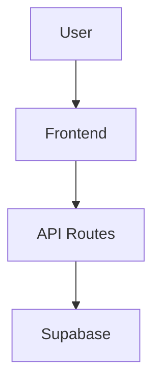

# 📚 Documentation Index

Complete guide to all documentation files in this project.

---

## 🎯 Start Here

**New to the project?** Read in this order:

1. **README.md** - Setup and installation
2. **ARCHITECTURE.md** - System overview with diagrams
3. **CODE_EXPLAINED.md** - How the code works
4. **ADMIN_GUIDE.md** - Using the admin panel
5. **QUICK_REFERENCE.md** - Common tasks

---

## 📖 Documentation Files

### 1. README.md
**Purpose:** Project setup and getting started
**Contains:**
- Installation instructions
- Environment setup
- Running locally
- Deployment guide
- Tech stack overview

**Read this if:** You're setting up the project for the first time

---

### 2. ARCHITECTURE.md ⭐
**Purpose:** System architecture and visual diagrams
**Contains:**
- System architecture diagram (Mermaid)
- Frontend-backend data flow (Sequence diagram)
- Component hierarchy (Graph)
- Admin authentication flow (State diagram)
- API routes structure (Graph)
- Database schema (ERD)
- Page rendering flow
- How frontend-backend communication works

**Read this if:** You want to understand how everything fits together

**Key Diagrams:**


---

### 3. CODE_EXPLAINED.md ⭐
**Purpose:** Line-by-line code explanations
**Contains:**
- Supabase client setup explained
- Admin authentication logic walkthrough
- API route implementations
- Admin dashboard code breakdown
- Public pages explained
- Component code walkthrough
- Complete request flow example
- Step-by-step project addition flow

**Read this if:** You want to understand what each line of code does

**Example:**
```typescript
// What this does:
const { data } = await supabase.from('projects').select('*')
// Explained: Queries Supabase database, gets all projects
```

---

### 4. ADMIN_GUIDE.md
**Purpose:** How to use the admin panel
**Contains:**
- Login instructions
- Adding/editing projects
- Adding/editing tutorials
- Markdown formatting guide
- Tips and best practices
- Troubleshooting

**Read this if:** You need to add or edit content

---

### 5. QUICK_REFERENCE.md ⭐
**Purpose:** Fast lookup for common tasks
**Contains:**
- File locations
- Environment variables
- Database query examples
- Authentication code snippets
- API request examples
- React patterns
- Common commands
- Troubleshooting

**Read this if:** You need quick code examples or solutions

---

### 6. CHANGELOG.md
**Purpose:** Record of all changes
**Contains:**
- Chronological list of updates
- Files modified in each update
- Bug fixes
- New features
- Deployment fixes

**Read this if:** You want to see project history

---

### 7. HOW_TO_ADD_PROJECTS.md
**Purpose:** Step-by-step guide for adding projects
**Contains:**
- Admin panel method
- Manual database method
- Field explanations
- Examples

**Read this if:** You're adding a new project

---

### 8. Remember_Prompt.MD
**Purpose:** Development guidelines
**Contains:**
- Coding rules
- File structure guidelines
- Best practices

**Read this if:** You're contributing to the project

---

## 🗺️ Navigation Guide

### I want to...

#### Understand the System
→ Read: `ARCHITECTURE.md`
→ Then: `CODE_EXPLAINED.md`

#### Set Up the Project
→ Read: `README.md`
→ Then: `ADMIN_GUIDE.md`

#### Add Content
→ Read: `ADMIN_GUIDE.md`
→ Or: `HOW_TO_ADD_PROJECTS.md`

#### Find Code Examples
→ Read: `QUICK_REFERENCE.md`
→ Then: `CODE_EXPLAINED.md`

#### Debug an Issue
→ Read: `QUICK_REFERENCE.md` (Common Issues)
→ Then: `CHANGELOG.md` (Recent changes)

#### Deploy to Production
→ Read: `README.md` (Deployment section)
→ Then: `CHANGELOG.md` (Verify latest changes)

---

## 📊 Documentation Structure

```
Documentation/
│
├── Getting Started
│   └── README.md
│
├── Understanding the Code
│   ├── ARCHITECTURE.md (Visual diagrams)
│   └── CODE_EXPLAINED.md (Line-by-line)
│
├── Using the System
│   ├── ADMIN_GUIDE.md (Admin panel)
│   ├── HOW_TO_ADD_PROJECTS.md (Adding content)
│   └── QUICK_REFERENCE.md (Quick lookup)
│
└── Project History
    ├── CHANGELOG.md (All changes)
    └── Remember_Prompt.MD (Guidelines)
```

---

## 🎨 Mermaid Diagrams

All visual diagrams are in `ARCHITECTURE.md`:

1. **System Architecture** - Overall structure
2. **Data Flow** - How data moves through the app
3. **Component Hierarchy** - How components are organized
4. **Authentication Flow** - Login/logout process
5. **API Routes** - Backend endpoints
6. **Database Schema** - Table structure
7. **Rendering Flow** - SSR vs CSR

**View diagrams:** Open `ARCHITECTURE.md` in GitHub or VS Code with Mermaid extension

---

## 🔍 Search Guide

### Find Information About...

| Topic | Document | Section |
|-------|----------|---------|
| **Setup** | README.md | Installation |
| **Environment Variables** | README.md, QUICK_REFERENCE.md | Configuration |
| **Database Queries** | QUICK_REFERENCE.md, CODE_EXPLAINED.md | Database |
| **Authentication** | ARCHITECTURE.md, CODE_EXPLAINED.md | Auth System |
| **API Routes** | ARCHITECTURE.md, CODE_EXPLAINED.md | API |
| **Components** | CODE_EXPLAINED.md | Components |
| **Admin Panel** | ADMIN_GUIDE.md | Usage |
| **Adding Projects** | HOW_TO_ADD_PROJECTS.md | Projects |
| **Styling** | QUICK_REFERENCE.md | Styling |
| **Deployment** | README.md | Deployment |
| **Troubleshooting** | QUICK_REFERENCE.md | Common Issues |

---

## 📝 Documentation Standards

All documentation follows these principles:

✅ **Clear headings** - Easy to scan
✅ **Code examples** - Show, don't just tell
✅ **Visual diagrams** - Mermaid charts where helpful
✅ **Step-by-step** - Numbered instructions
✅ **Cross-references** - Links to related docs
✅ **Up-to-date** - Updated with code changes

---

## 🚀 Quick Start Paths

### Path 1: Developer (Understanding Code)
1. README.md (Setup)
2. ARCHITECTURE.md (System overview)
3. CODE_EXPLAINED.md (Code details)
4. QUICK_REFERENCE.md (Code snippets)

### Path 2: Content Manager (Using Admin)
1. README.md (Setup)
2. ADMIN_GUIDE.md (Admin panel)
3. HOW_TO_ADD_PROJECTS.md (Adding content)

### Path 3: Contributor (Making Changes)
1. README.md (Setup)
2. ARCHITECTURE.md (System overview)
3. Remember_Prompt.MD (Guidelines)
4. CHANGELOG.md (Recent changes)
5. CODE_EXPLAINED.md (Code details)

---

## 💡 Tips

1. **Use Ctrl+F** to search within documents
2. **Open multiple docs** side-by-side for reference
3. **Check CHANGELOG.md** before making changes
4. **Update docs** when you change code
5. **Use Mermaid preview** in VS Code for diagrams
6. **Bookmark QUICK_REFERENCE.md** for fast lookup

---

## 📱 Mobile-Friendly

All documentation is written in Markdown and works great on:
- GitHub (web)
- VS Code
- Mobile GitHub app
- Any Markdown viewer

---

## 🔄 Keeping Docs Updated

When you make changes:

1. **Update CHANGELOG.md** - Record what changed
2. **Update relevant docs** - If code behavior changes
3. **Add examples** - If new features added
4. **Update diagrams** - If architecture changes

---

## 📧 Need Help?

If documentation doesn't answer your question:

1. Check **QUICK_REFERENCE.md** for common issues
2. Review **CODE_EXPLAINED.md** for code details
3. Look at **CHANGELOG.md** for recent changes
4. Check **ARCHITECTURE.md** for system design

---

## ✅ Documentation Checklist

Before deploying:

- [ ] README.md updated with any new setup steps
- [ ] CHANGELOG.md has entry for changes
- [ ] ARCHITECTURE.md diagrams reflect current structure
- [ ] CODE_EXPLAINED.md covers new code
- [ ] QUICK_REFERENCE.md has new patterns/examples
- [ ] ADMIN_GUIDE.md updated if admin UI changed

---

**Happy coding! 🚀**

For questions about the documentation itself, see `CHANGELOG.md` for the documentation creation entry.
